# 티켓 판매 애플리케이션

#### 1. 티켓 판매 애플리케이션 개발

극장이 있다.
극장에 입장하려는 관람객은 추첨을 통해 초대장을 받은 사람과 받지 못한 사람이 있다.
관람객을 입장시키기 전에 초대장을 갖고 있는지 확인해야 한다.
이를 위해서는 매표소가 있으며 매포소에는 판매원이 있다.
초대장이 있는 관람객은 초대장을 티켓으로 교환 후 입장할 수 있다.
반면에 초대장이 없는 관람객은 티켓을 구매해야만 입장할 수 있다.

#### 1.1. 구현

#### 1.1.1. 초대장 클래스

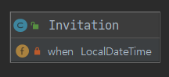

```java
public class Invitation {
    private LocalDateTime when;
}
```

초대장 클래스는 간단하게 구현되었다.
초대일자(when)를 인스턴스 변수로 갖고 있다.

#### 1.1.1. 티켓 클래스

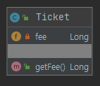

```java
public class Ticket {
    private Long fee;

    public Long getFee() {
        return fee;
    }
}
```

극장에 입장을 하기 위해서는 티켓을 소지해야 한다.
해당 티켓은 추첨을 통해 추첨된 사람들만 초대장을 갖고 있을 것이다.

#### 1.1.2. 가방 클래스

관람객은 소지품을 보관할 Bag을 갖고 있다고 가정한다.

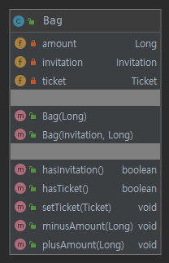

```java
public class Bag {
    private Long amount;
    private Invitation invitation;
    private Ticket ticket;

    public Bag(Long amount) {
        this.amount = amount;
    }

    public Bag(Invitation invitation, Long amount) {
        this.amount = amount;
        this.invitation = invitation;
    }

    public boolean hasInvitation() {
        return invitation != null;
    }

    public boolean hasTicket() {
        return ticket != null;
    }

    public void setTicket(Ticket ticket) {
        this.ticket = ticket;
    }

    public void minusAmount(Long amount) {
        this.amount -= amount;
    }

    public void plusAmount(Long amount) {
        this.amount += amount;
    }
}
```

Bag 클래스는 초대장(invitation), 티켓(ticket), 현금(amount)을 인스턴스 변수로 갖는다.
티켓과 초대장 여부를 판단하는 hasInvitation와 hasTicket 메서드가 있다.
현금을 증가시키거나 감소시키는 plusAmount, minusAmount 메서드도 있다.
여기서 Bag은 현금만 있거나 초대장과 현금이 있는 경우 2가지가 있기에 해당하는 생성자 2개가 있다.

#### 1.1.4. 관람객 클래스

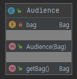

```java
public class Audience {
    private Bag bag;

    public Audience(Bag bag) {
        this.bag = bag;
    }

    public Bag getBag() {
        return bag;
    }
}
```

극장에 입장하려는 관람객은 가방(Bag)을 갖고 있으므로 인스턴스 변수로 포함하고 있다.

#### 1.1.5. 매표소 클래스

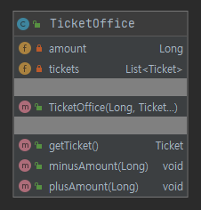

```java
public class TicketOffice {
    private Long amount;
    private List<Ticket> tickets = new ArrayList<>();

    public TicketOffice(Long amount, Ticket... tickets) {
        this.amount = amount;
        this.tickets.addAll(Arrays.asList(tickets));
    }

    public Ticket getTicket() {
        return tickets.remove(0);
    }

    public void minusAmount(Long amount) {
        this.amount -= amount;
    }

    public void plusAmount(Long amount) {
        this.amount += amount;
    }
}
```

매표소는 다수의 티켓을 갖고 있다.
매표소에서 티켓을 하나씩 반환하는 getTicket 메서드는 인스턴스 변수인 tickets에서 하나씩 소모한다.
또한 판매 금액을 더하거나 차감하는 plusAmount, minusAmount 메서드가 구현돠어 있다.

#### 1.1.6. 판매원 클래스

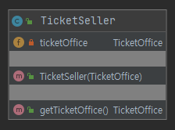

```java
public class TicketSeller {
    private TicketOffice ticketOffice;

    public TicketSeller(TicketOffice ticketOffice) {
        this.ticketOffice = ticketOffice;
    }

    public TicketOffice getTicketOffice() {
        return ticketOffice;
    }
}
```

판매원 클래스는 자신이 일하는 매표소(TicketOffice)를 알고 있어야 하므로 인스턴스 변수인 ticketOffice를 갖는다.

#### 1.1.7. 극장 클래스

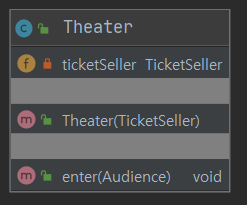

```java
public class Theater {
    private TicketSeller ticketSeller;

    public Theater(TicketSeller ticketSeller) {
        this.ticketSeller = ticketSeller;
    }

    public void enter(Audience audience) {
        if (audience.getBag().hasInvitation()) {
            Ticket ticket = ticketSeller.getTicketOffice().getTicket();
            audience.getBag().setTicket(ticket);
        } else {
            Ticket ticket = ticketSeller.getTicketOffice().getTicket();
            audience.getBag().minusAmount(ticket.getFee());
            ticketSeller.getTicketOffice().plusAmount(ticket.getFee());
            audience.getBag().setTicket(ticket);
        }
    }
}
```

극장에서 판매 행위를 하는 판매원을 인스턴스 변수인 ticketSeller를 갖는다.
극장 클래스는 enter 메서드를 통해 관람객인 audience를 받아 입장을 처리한다.
여기서 audience의 가방을 호출하여 초대장 소지 여부에 따라 티켓 처리를 하고 있다.

#### 1.1.8. 정리

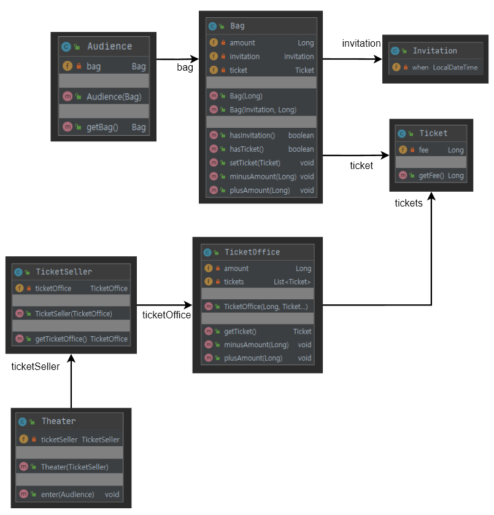

극장은 관람객을 입장을 처리하기 위해서는 먼저 관람객의 가방을 꺼내 초대장이 들어 있는지 확인한다.
초대장이 있다면 판매원을 통해 매표소를 갖고와서 티켓을 얻고 관람객 가방안에 티켓을 넣는다.
만약 초대장이 없다면 관람객 가방을 갖고와서 금액을 차감하고 위와 동일하게 관람객 가방에 티켓을 넣는다.

#### 1.2. 문제점

#### 1.2.1 수동적인 객체

객체 지향적 관점에서 극장 클래스를 분석해 본다.
극장 클래스는 관람객 입장을 처리하기 위해서 관람객의 가방을 직접 꺼내서 초대장을 확인하고 있다.
게다가 티켓을 얻는 과정에서도 판매원의 매표소를 직접 꺼내서 티켓을 꺼내간다.
그리고 이를 다시 관람객 가방을 꺼내서 초대장을 넣고 있고 초대장이 없는 경우에는 돈을 함부로 건드리고 있다.
현실에서는 관람객이 직접 가방에서 초대장을 꺼내 판매원에게 건넨다.
티켓을 구매하는 관람객은 직접 돈을 가방에서 꺼내 판매원에게 지불한다.
판매원은 매표소의 티켓을 직접 꺼내 관람객에게 주고 돈을 받으며 이를 매표소에 보관한다.
그러나 코드에서는 현실과는 맞지 않는 내용으로 코드가 구현이 되어 있다.

#### 1.2.2 과한 기억 정보

Theater 클래스의 enter 메서드를 보면 세부적인 내용들을 한꺼번에 기억해야 한다.
enter 메서드를 이해하기 위해서는 관람객, 관람객의 가방, 가방안에 초대장 그리고 판매원과 판매원이 근무하는 매표소를 알아야 한다.
관람객이 입장한다는 사실을 이해하기에는 너무 많은 요소들을 알고 기억해야하는 부담감이 있다.

#### 1.2.3 변경에 취약한 코드

관람객이 가방을 소지하지 않고 있거나 현금이 아닌 신용카드를 이용해 결제를 한다고 조건을 변경하면 어떻게 수정을 해야하는가?
만약 가방을 소지하고 있지 않다면 Audience 클래스에서 Bag을 제거해야한다.
그리고 Theater 클래스의 enter 메서드에서 Bag에 대한 소스도 수정해야 한다.
이는 Theater 클래스가 Audience 클래스의 내부적인 정보를 더욱 많이 알수록 변경할 곳이 많아진다.

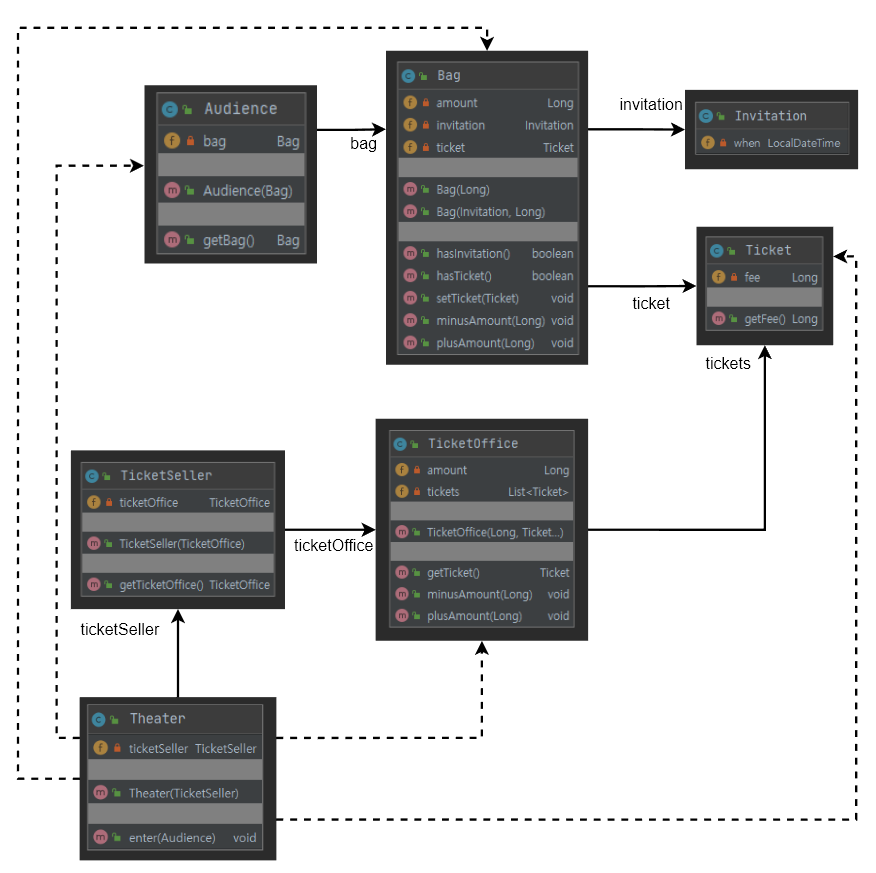

Theater 클래스를 보면 점선으로 이어진 점선은 Theater 클래스가 의존하고 있는 클래스이다.
Theater 클래스가 조건이 변경될 경우 수정사항이 쉽게 생기는 이유는 의존성(dependency) 때문이다.
의존성은 어떤 객체가 변경될 때 그 객체에게 의존하는 다른 객체도 변할 수 있다는 의미를 내포하고 있다.
의존성을 완전히 없애는 것은 불가능하며 최소한의 의존성을 만들고 불필요한 의존성을 제거하는 것이 좋다.
이렇게 의존성이 높은 경우를 결합도(coupling)이 높다고 표현한다.

#### 1.3. 개선

Theater 클래스가 관람객의 가방과 판매원의 매표소에 직접 접근한다는 것은 Theater가 Audience와 TicketSeller 에 의존한다는 의미이다.
이는 Audience와 TicketSeller 가 변경될 경우 Theater 도 변경할 수 있다는 의미이다.
이렇게 수정에 취약한 이유는 Theater 가 과도하게 세부적이 내용을 담고 있다는 의미이며 불필요한 의존성을 갖고 있다고 해석할 수 있다.

#### 1.3.1. 자율성 향상

Theater 의 불필요한 의존성을 제거하고 각 객체의 자율성을 높여야 한다.

```java
public class Theater {
    private TicketSeller ticketSeller;

    ...

    public void enter(Audience audience) {
        ticketSeller.sellTo(audience);
    }
}
```

Theater 클래스의 enter 메서드의 세부적인 내용을 내용을 변경하였다.
enter 메서드는 관람객(audience)을 받아 ticketSeller 에게 판매를 위임하며 단순하게 코드는 마무리한다.

```java
public class TicketSeller {
    private TicketOffice ticketOffice;

    ...

    public void sellTo(Audience audience) {
        ticketOffice.plusAmount(audience.buy(ticketOffice.getTicket()));
    }
}
```

TicketSeller 의 sellTo 관람객에게 티켓을 판매하는 메서드이다.
해당 메서드는 관람객(audience)이 능동적으로 티켓을 구매하며 발생한 금액을 매표소(ticketOffice)에 돈을 넣고 있다.

```java
public class Audience {
    private Bag bag;

    ...

    public Long buy(Ticket ticket) {
        if (bag.hasInvitation()) {
            bag.setTicket(ticket);
            return 0l;
        } else {
            bag.setTicket(ticket);
            bag.minusAmount(ticket.getFee());
            return ticket.getFee();
        }
    }
}
```

Audience 클래스는 구매(buy)를 능동적으로 하고 있으며 가방을 통해 초대장 소지 여부를 통해 로직을 수행하고 있다.

#### 1.3.2. 다시 생각해보기

이제 다시 생각해본다.
다시, 관람객이 가방을 소지하지 않고 있거나 현금이 아닌 신용카드를 이용해 결제를 한다고 조건을 변경하면 어떻게 수정을 해야하는가?
이제는 Theater 클래스를 수정할 필요가 없다.
수정된 TicketSeller 와 Audience는 자신의 TicketOffice 와 Bag 를 스스로 관리하고 접근한다.
이는 사람과의 의사소통이라는 관점에서 개선이 되었다.
핵심은 객체 내부의 상태를 캡슐화하고 객체 간에 오직 메세지를 통해서만 상호작용하도록 만들었다는 것이다.
이는 응집도를 높이는 방법이다.
Theater 는 더 이상 TicketSeller 의 내부에 대해서 몰라도 좋다.
단지 sellTo 메세지를 이해하고 응답할 수 있다는 사실만 알고 있다.

#### 1.4. 정리

#### 1.4.1. 절차지향과 객체지향

개선된 되기 전에 Theater 클래스와 개선 후에 Theater 를 비교한다.

```java
// 개선하기 전!
public class Theater {

    ...

    public void enter(Audience audience) {
        if (audience.getBag().hasInvitation()) {
            Ticket ticket = ticketSeller.getTicketOffice().getTicket();
            audience.getBag().setTicket(ticket);
        } else {
            Ticket ticket = ticketSeller.getTicketOffice().getTicket();
            audience.getBag().minusAmount(ticket.getFee());
            ticketSeller.getTicketOffice().plusAmount(ticket.getFee());
            audience.getBag().setTicket(ticket);
        }
    }
}
```

개선하기 전에는 enter 메서드가 모든 처리를 했다.
단지, 처리를 위한 필요한 정보를 모두 제공받고 있다는 점이다.
여기서 enter 메서드는 프로세스(Process)이며 audience, ticketSeller, bag, ticketOffice 는 데이터(Data)다.
이처럼 프로세스와 데이터를 별도의 모듈에 위치시키는 방식을 절차적 프로그래밍(Procedural Programming)이라 한다.
이는 일반적인 직관에 위배되며 데이터의 변경으로 인한 영향을 지역적을 고립시키기 어렵다.

그러나 개선 후의 코드는 프로세스와 데이터가 동일한 모듈 내부에 위치한다.
이는 각 객체가 문제 해결에 있어서 스스로 해결한다.
이러한 방식을 객체지향 프로그래밍(Object-Oriented Programming)이라 한다.

#### 1.4.2. 책임 이동

개선 전과 개선 후의 차이는 책임의 이동이다.

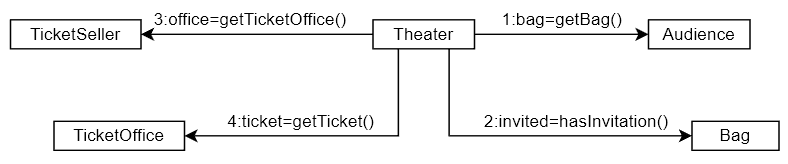

개선 전에는 입장(enter) 처리에 대해 Theater 가 전부 책임을 갖고 있었다.
이로 인해 수정사항에 유연하게 대처하지 못했다.


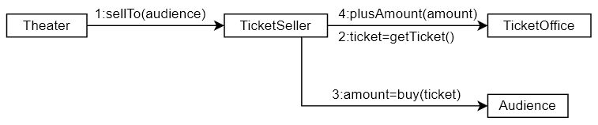

개선 후에는 Theater 가 모든 책임을 갖고 있지 않다.
티켓을 판매하는 책임은 ticketSeller 에게 있고 티켓을 구매하는 행위는 audience 에게 책임이 있다.

#### 1.4.3. 트레이드 오프

개선된 버전에서 더욱 자율성을 높일 수 있다.

#### 1.4.4. 의인화